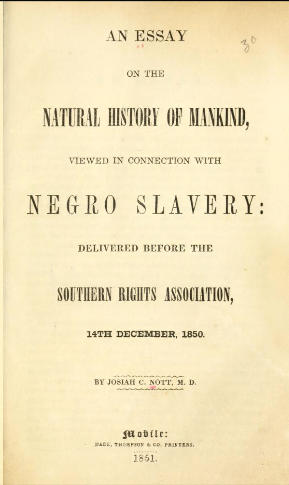
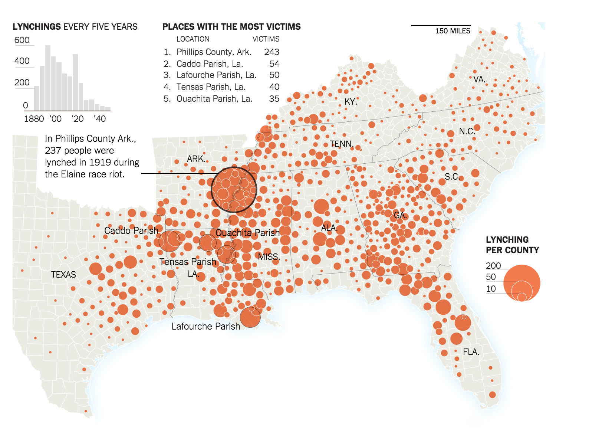
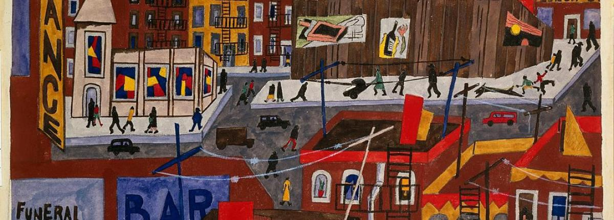
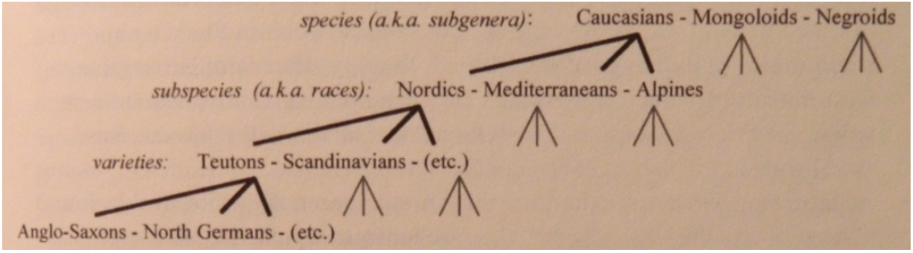
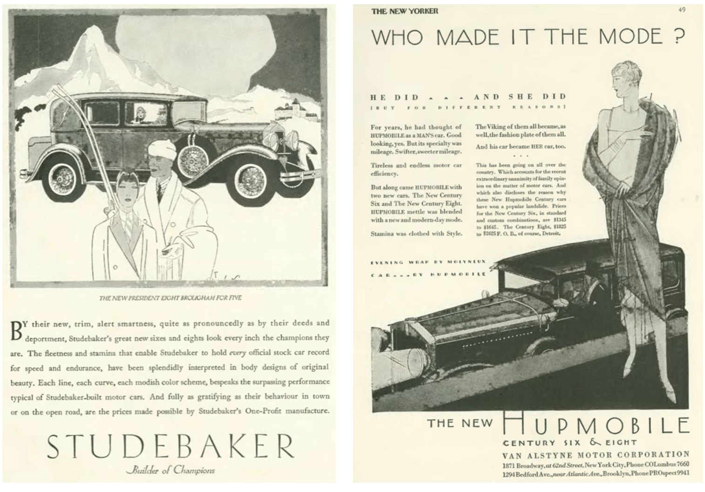

```{r setup, include=FALSE, message = FALSE, warning=FALSE, error=FALSE}
knitr::opts_chunk$set(echo = FALSE, message = FALSE, warning=FALSE, error=FALSE, tidy='styler')
knitr::knit_engines$set(python = reticulate::eng_python)
```

```{r load_packages}
#Data wrangling
library(tidyverse)
library(tidytext)
library(stringr)
library(lubridate)

#Python interoperability
library(reticulate)

#Visualization
library(plotly)

#Output
library(shiny)
library(scales)
library(webshot)
```

# Introduction

Two arguments:

1. **Queer** is not associated with sexuality in the 1920s in the same way that we understand it now:

`r format(Sys.time(), "%a %b %d %X %Y")`

2. In the 1920s, America there is radical change in the way identity is configured. The erstwhile concept of "racial binarism" is scrambled, and, concomitantly, the way in which people imagine their own desires becomes complicated by the increasingly porous color line.

# Race

Enslavement and subsequent racialized labor practices were one of the central axes along which America developed as a nation. Though the social construction of "race" is not a uniquely American concept, it has led to specific set of historical conditions for understanding identity in the American context.

## Enslavement and Economics in America

- The emergence of America as a global economic powerhouse in the 19th century was deeply dependent on enslavement and racialized labor practices.  
  - Cotton constituted 60% of all export value before the Civil War [@beckertEmpireCottonGlobal2015 206]
    
  

## Enslavement and "Race"

- Initially, enslavement could be justified through religious means, by the middle of the 19th century "race" played an increasingly prominent role.

<figure>

<figcaption>Although Nott's work precedes *The Origin of Species* by four years, there were already racial and evolutionary theories "in the air"</figcaption>
</figure>

## Race and Sex

- The plantation system relied on the strict separation between the races, even if this was not the ground reality.

>"The children of miscegenation not only threatened to blur the distinctions that made slavery possible, but the unions that produced them threatened to distort sexual relations and marriage itself, for black and white alike, into peculiar and tragic forms" [@sundquistFaulknerHouseDivided1983 116].


## Miscegenation and incest

- Because both were "crimes of blood", incest and "miscegenation" were often seen as two sides of the same coin [@RN26 71]. 

- The fear of White and Black "mixing" was so great that up until Loving vs. Virginia in 1967, the state of Mississippi prohibited "interracial" marriage. The statute was not removed from the state constitution till 1987 [@RN24 250].

- People had to reproduce with partners who were sufficiently similar and disimilar.

## Agragian Community

- In many former slave states, the local communities around plantations was small enough to where most people could trace kinship. As a result, the avenues to marriage were tightly patrolled.


# Scrambling Race

America's race system was never stable nor monolithic, but gets disrupted by three major forces in the early 20th century:

- Jim Crow and The Great Migration
- Mass Immigration
- Modernization

# Jim Crow and the Great Migration

- After the Civil War vested economic interests maintain power through a campaign of terror.

- Soon after the end of Reconstruction, states started to institute "Jim Crow" laws, which enforced the legal segregation of "White" and "Black."

## Violence

- These laws were often enforced through extra-judicial means, especially lynching

- Between 1890 and 1954 roughly 3,000 African Americans were lynched.
 
 - That's about one lynching per week.



## Interactive Map of Lynchings

 <iframe src="https://plaintalkhistory.com/monroeandflorencework/explore/map2/" data-preload height = 600 width = 800>
 </iframe>


## Mass Migration

- Threatened by racial terror in the South and lured by the prospect of decent jobs in the North many Blacks migrated north in the "Great Migration."


- Many "passed" as white

## "Harlem" Renaissance

- The concentration of Blacks in urban spaces that allowed them relatively more mobility and economic independence, led to a flowering of Black culture generally known as the Harlem Renaissance. Centered in NY this flowering was widespread in several urban centers, including Chicago.

- Nella Larsen was one of the major figures of this movement.




# Mass Immigration

- The period from the late nineteenth century to 1924 saw mass immigration to the US from Russia, Eastern Europe, Italy, and Ireland

- A some point 15% of the US population was foreign born.

## Conservative Backlash

- The introduction of new peoples was considered a threat by many people who saw the "traditional" American way of life eroding.

- In 1915, the Ku Klux Klan was reconstituted. This second incarnation was mostly focused on targeting new immigrants, especially Catholics and Jews.

  - There were roughly 5 million men and 1.5 million women in the KKK [@bleeWomenKlanRacism1991d 190] 


## Racial pseudo-science

- As a way to sort out America's changing racial mosaic a racial pseudo-science emerged to "sort out" the various races and their value.



- The theories were totally bogus, but they turned "race" into the central means of understanding identity.

- Sexuality, gender, and class were all explicitly linked to race.

# Modernization

The 1920s saw the rapid modernization of America. Buoyed by a post-War production boom, and new, more efficient production methods such as vertical integration, the standard of living for most Americans went up.

## Marketting

- The surplus of goods led to new and creative ways to connect them to consumers.



- Marketing became more sophisticated, and Americans were increasingly inundated with aspirations of what they could be.


## Mobility and Mass Communication

- Mobility and mass communication (magazines, film, and radio) all spurred the creation of a more interconnected nation. 

- The discourse of the nation was by and large determined by the hubs for mass media production: New York and Los Angeles.

- People were at once more connected and increasingly uneasy about their place in the local community.

# Queering Race

In the face of a rapidly changing economic, social, and cultural reality, race had become one the main anchors through which people could moor onto their place in the world. When race was scrambled it also disrupted people's perceptions of their class, gender, and sexuality precisely because these were interrelated and overlapping constructions of the self. 

## Random Questions on Larsen and Faulkner

How might both Larsen and Faulkner disrupt the "traditional" formula of desiring to marry for the sake of reproduction?

In Larsen and Faulkner, how do difference and sameness operate as two complex forces that produce desire?

To what extent is sexual desire about the act and to what extent is it about the object?

# Works Cited


