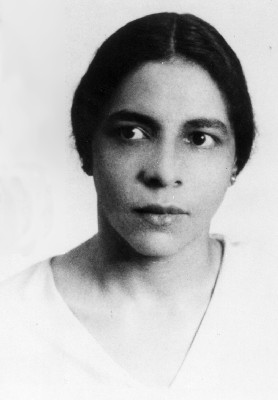
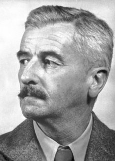

```{r setup, include=FALSE, message = FALSE, warning=FALSE, error=FALSE}
knitr::opts_chunk$set(echo = FALSE, message = FALSE, warning=FALSE, error=FALSE, tidy='styler')
knitr::knit_engines$set(python = reticulate::eng_python)
```

```{r load_packages}
#Data wrangling
library(tidyverse)
library(tidytext)
library(stringr)
library(lubridate)

#Python interoperability
library(reticulate)

#Visualization
library(plotly)

#Output
library(shiny)
library(scales)
library(webshot)
```

# Introduction

Two arguments:

1. **Queer** is not associated with sexuality in the 1920s in the same way that we understand it now:

`r format(Sys.time(), "%a %b %d %X %Y")`

2. In the 1920s, America there is radical change in the way identity is configured. The erstwhile concept of "racial binarism" is scrambled, and concomitantly the way in which people imagine their own desires becomes complicated by the increasingly porous color line.

# Race

## Enslavement and Race in America

- The emergence of America as a global economic powerhouse in the 19th century was deeply dependent on racialized enslavement and labor practices.  
  - Cotton constituted 60% of all export value before the Civil War [@beckertEmpireCottonGlobal2015 206]

- Initially, enslavement could be justified through religious means, by the middle of the 19th century "race" played an increasingly prominent role.

## Race and Sex

- The plantation system relied on the strict separation between the races, even if this was not the ground reality.

>"The children of miscegenation not only threatened to blur the distinctions that made slavery possible, but the unions that produced them threatened to distort sexual relations and marriage itself, for black and white alike, into peculiar and tragic forms" [@sundquistFaulknerHouseDivided1983 116].


## Miscegenation and incest

- Quite counterintuitively, incest and "miscegenation" were often seen as two sides of the same coin, as they were both crimes of "blood" [@RN26 71]. 

- The fear of White and Black "mixing" was so great that up until Loving vs. Virginia in 1967, the state of Mississippi prohibited "interracial" marriage. The statute was not removed from the state constitution till 1987 [@RN24 250].

# Scrambling Race

## Jim Crow

- After the Civil War vested economic interests maintain power through a campaign of terror.

## Mass Migration

- Over 1 million African Americans make their way North to leave the terror of the South

- Many "passed" as white

## Mass Immigration

- Over 25% of the population of the US becomes immigrants due to mass immigration

## Racial pseudo-science

- As a way to sort out America's changing racial mosaic a racial pseudo-science emerged to "sort out" the various races and their value.


# Works Cited

<span></span>


